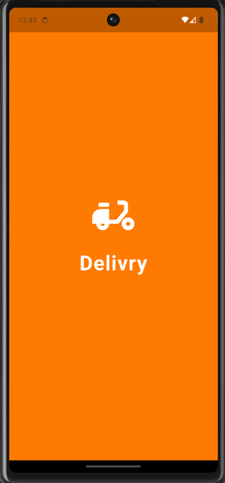
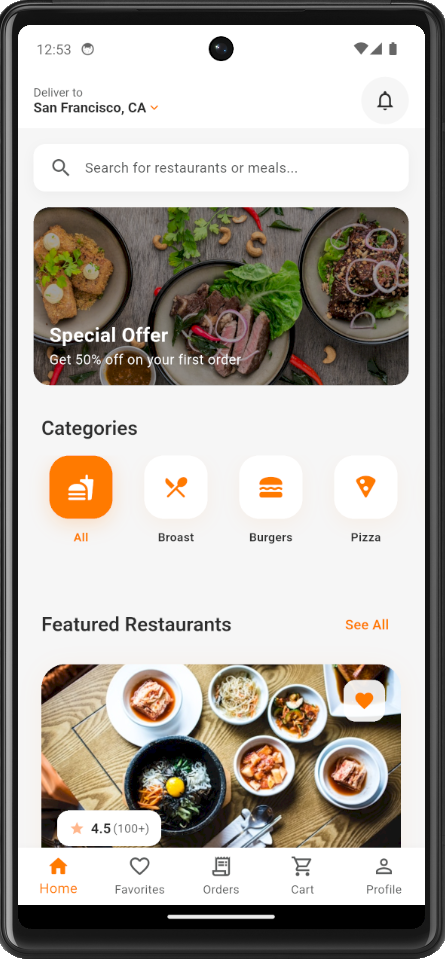
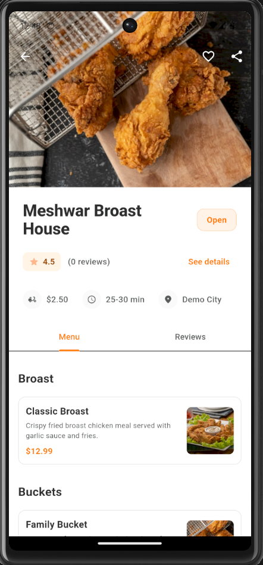
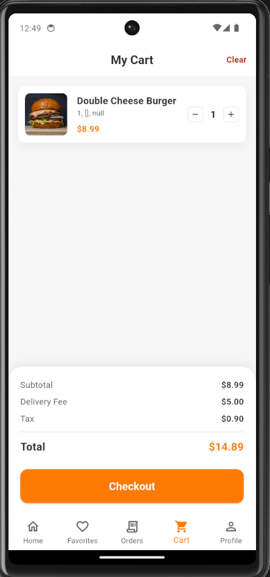
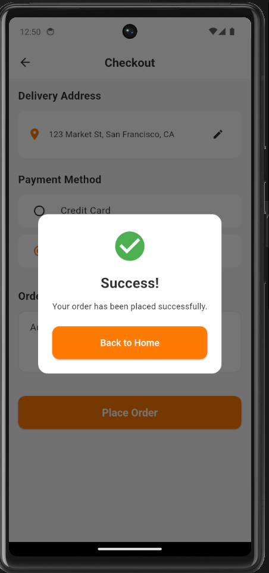
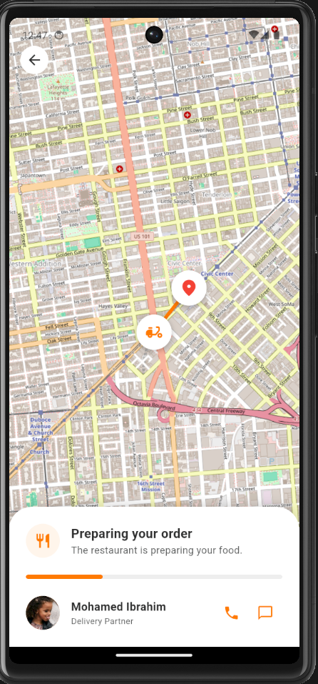
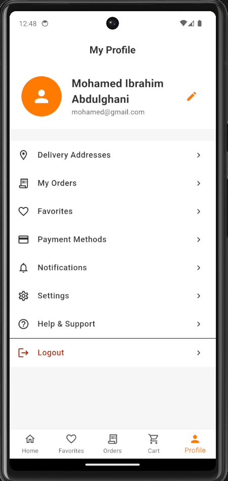

# 🚴 Delievry_App - On-Demand Food Delivery Application

<p align="center">
  
  
  
</p>

## 📖 نبذة عن المشروع (Project Overview)
[cite_start]**Delievry_App** هو تطبيق هاتف محمول متطور ومتكامل لطلب وطهي وتوصيل الطعام على غرار التطبيقات العالمية الشهيرة مثل "طلبات"[cite: 197]. [cite_start]تم بناء التطبيق باستخدام بيئة عمل **Flutter** ليعمل بكفاءة عالية على نظامي Android و iOS بكود برمجي موحد[cite: 3, 200, 235].

[cite_start]يهدف المشروع إلى توفير تجربة مستخدم سلسة وعصرية تعتمد على **الوضع الفاتح (Light Theme)** [cite: 31][cite_start]، وتربط ديناميكياً بين ثلاثة أطراف رئيسية[cite: 4, 12]:
1. [cite_start]**العميل (Customer):** لتصفح المطاعم، إضافة الوجبات للسلة، الدفع، وتتبع الطلب[cite: 206, 241].
2. [cite_start]**المطعم (Restaurant Partner):** لاستقبال الطلبات، إدارتها، وتجهيز المنيو[cite: 207].
3. [cite_start]**الكابتن/المندوب (Delivery Driver):** لقبول طلبات التوصيل القريبة والوصول للوجهة عبر الخريطة[cite: 208].

---

## 🎨 النظام التصميمي والهوية البصرية (Design System)

[cite_start]تم فحص واجهات التطبيق الفعلية بدقة واشتقاق لوحة الألوان والخطوط لتعبّر تماماً عن الهوية البصرية الحية للتطبيق[cite: 24].

### 🔴 لوحة الألوان الفعلية (Color Palette)

| العنصر | كود الـ Hex | الاستخدام في الواجهات |
| :--- | :--- | :--- |
| **البرتقالي الحيوي** | `#FF6F00` | اللون الأساسي للتطبيق؛ [cite_start]يُسخدم للأزرار الرئيسية (CTA)، الأوامر التفاعلية، ومسارات التوجيه[cite: 24]. |
| **الخلفية الأساسية** | `#FFFFFF` | [cite_start]اللون الأبيض النقي للخلفيات لتوفير مظهر نظيف وإبراز صور الأكلات[cite: 24]. |
| **الرمادي الناعم** | `#F5F5F7` | [cite_start]خلفيات بطاقات الطعام (Cards)، شريط البحث، وحقول الإدخال[cite: 24]. |
| **النصوص والعناوين** | `#1A1A1A` | [cite_start]اللون الأسود الداكن لضمان تباين ممتاز وقراءة مريحة للعناوين والأسعار[cite: 24]. |
| **الأخضر التأكيدي** | `#10B981` | يُستخدم لإشعارات النجاح، تأكيد الطلبات، وحالات التوصيل الناجحة. |

### 🔤 الخطوط المستخدمة (Typography)
* [cite_start]يعتمد التطبيق على خطوط **Google Fonts** العصرية (مثل **Inter** و **Poppins** للواجهات الإنجليزية بالتكامل مع خط **Cairo** أو **Tajawal** للغة العربية) لضمان انسيابية النصوص وتناسقها مع أحجام الشاشات المختلفة[cite: 124].

---

## 📸 لقطات من داخل التطبيق (App Screenshots)

[cite_start]يحتوي المشروع على **18 واجهة مستخدم** متكاملة تم تنظيمها بروابط نسبية ذكية لتظهر مباشرة على حسابك في GitHub بدون أخطاء[cite: 25, 34]:

<p align="center">
  
  
  
  
</p>

<p align="center">
  
  
  
  
</p>

### 📱 دليل الواجهات الـ 18 المتضمنة في مجلد المستودع:
* [cite_start]**`landing_page`**: الواجهة الترحيبية الأولى للهبوط بهوية التطبيق الجذابة[cite: 25].
* **`login` / `register` / `reset_password`**: الشاشات الخاصة بمنظومة تسجيل الدخول وإنشاء الحسابات.
* **`OPT_Verification`**: واجهة التحقق عبر كود الدخول المؤقت لأمان الحسابات.
* **`home` / `search_page`**: الشاشات الرئيسية لتصفح الوجبات، الأقسام، واستخدام فلاتر البحث الذكية[cite: 25].
* **`restaurant_page` / `select_order`**: استعراض منيو المطعم المختار وتخصيص تفاصيل الوجبة.
* **`favorites_page`**: قائمة حفظ الأطعمة والمطاعم المفضلة للوصول السريع إليها.
* [cite_start]**`my_cart` / `checkout_page` / `place_order`**: سلة المشتريات، اختيار مراجعة الحساب، وإإتمام الطلب[cite: 25].
* **`tracking_order`**: شاشة تتبع الكابتن حياً على الخريطة في الوقت الفعلي[cite: 25].
* **`my_orders` / `order_details` / `past_order`**: إدارة ومتابعة الطلبات الجارية وأرشيف الطلبات السابقة.
* **`my_profile_page`**: التحكم في البيانات الشخصية، الإعدادات، والعناوين المحفوظة[cite: 25].

---

## 🚀 الميزات الأساسية للمشروع (Core Features)

### 👤 تطبيق العميل (Customer App)
* [cite_start]**تحديد المواقع الذكي:** التعرف التلقائي على الموقع عبر الـ GPS وحفظ عناوين متعددة (المنزل / العمل)[cite: 211, 212].
* [cite_start]**سلة مرنة:** إضافة وتعديل مكونات الوجبات مع كتابة ملاحظات خاصة للمطبخ[cite: 213].
* **الدفع المتعدد:** دعم الدفع النقدي عند الاستلام (COD) والدفع الإلكتروني (البطاقات والمحافظ)[cite: 215, 216].
* [cite_start]**التتبع الحي:** عرض حركة المندوب مباشرة على الخريطة باستخدام Google Maps API[cite: 218].

### 🍳 لوحة تحكم المطاعم (Restaurant Panel)
* [cite_start]**إدارة فوريّة للطلبات:** استقبال تنبيهات صوتية قوية للطلبات الجديدة وقبولها أو رفضها مع تحديد وقت التحضير[cite: 220, 221].
* **التحكم بالمنيو:** إضافة الوجبات وتحديث الأسعار أو تحويل الوجبات غير المتوفرة إلى (Out of stock)[cite: 222, 223].

### 🚗 تطبيق المندوب (Driver App)
* [cite_start]**تغيير الحالة:** زر مرن للتحول إلى (نشط / غير نشط) لاستقبال الطلبات حسب الرغبة[cite: 225].
* [cite_start]**الطلبات الذكية:** استقبال الطلبات القريبة جغرافياً مع توضيح المكسب وموقع المطعم والعميل[cite: 226].
* **التوجيه الديناميكي:** رسم أسرع مسار على الخريطة للوصول للمطعم ثم العميل[cite: 227].

---

## 🛠️ التقنيات المستخدمة (Tech Stack)
* [cite_start]**واجهات المستخدم (Frontend):** Flutter & Dart Framework[cite: 235].
* [cite_start]**الخرائط والمواقع:** Google Maps Flutter SDK[cite: 238].
* **الإشعارات الفورية:** Firebase Cloud Messaging (FCM)[cite: 239].
* [cite_start]**التحقق والتأمين:** Firebase Auth / SMS OTP Verification[cite: 240].

---

## 💻 طريقة تشغيل المشروع محلياً (Installation Guide)

إذا كنت ترغب في تشغيل المشروع على جهازك الشخصي ومعاينة الواجهات الـ 18، يرجى اتباع الخطوات التالية:

### 1️⃣ تحميل المستودع
قم بفتح الـ Terminal الخاص بك وعمل Clone للمستودع:
```bash
git clone [https://github.com/MohamedIbrahimAbdulghani/Delievry_App.git](https://github.com/MohamedIbrahimAbdulghani/Delievry_App.git)
cd Delievry_App
```


### 2️⃣ تثبيت الاعتماديات وحزم Flutter
قم بفتح الـ Terminal الخاص بك وعمل Clone للمستودع:
```bash
flutter pub get
```


### 3️⃣ تجهيز وفحص المحاكي
قم بفتح الـ Terminal الخاص بك وعمل Clone للمستودع:
```bash
flutter devices
```

### 4️⃣ تشغيل التطبيق
قم بفتح الـ Terminal الخاص بك وعمل Clone للمستودع:
```bash
flutter run
```